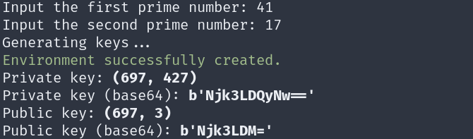
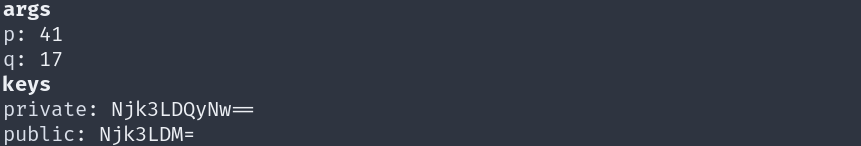

# Usage Example
 
This guide provides examples of usage of the commands you might need.

## Creating an environment

In order to generate private and public keys, one must initialize an "environment" (just a folder we use to store configuration files). For that end, type:

```
python main.py init
```

You will be prompt 2 prime numbers to use during key generation. At the end of the process, you should get a message like this:



If you use this command, and an environment already exists, you'll be asked if wish to recreate a new one, or skip.

## Showing information about the environment

If needed, you may show which keys and prime numbers you have on the local environment:

```
python main.py env describe
```

Something similar should be displayed:



## Encrypting a message

Once the keys are generated, you are ready to encrypt a message. This can be accomplished in two ways:

providing the text directly as input:

```
python main.py encrypt "Turing machines rules!"
```

or providing the path to a file containing the input text:

```
python main.py encrypt input.txt
```

If the `init` was used, you don't need to provide any key to this command, althoug this is an option:

```
python main.py encrypt input.txt --pkey Njk3LDM=
```

Furthermore, the output might be written to a file:

```
python main.py encrypt input.txt --pkey Njk3LDM= --dest output.txt
```

After running this last command we obtain the same as running the first:

```
254 604 419 605 427 528 9 3 300 75 603 605 427 135 21 9 419 604 233 135 390
```

## Decrypting a message

The `decrypt` command provides the same options and respective funcionalities as the `encrypt` command. Hence, using the keys of this example, we could decrypt the above encrypted message using:

```
python main.py decrypt output.txt --pkey Njk3LDQyNw== --dest final.txt
```

Which would result in the initial string:

```
Turing machines rules!
```

## Providing keys as pairs of numbers

By default, the `init` command generates the keys encoded using base64, thus, the `--pkey` parameters accept a key encoded using base64. But, you may provide a key as a pair of numbers and it should work just fine:

```
python main.py encrypt input.txt --pkey (697, 3) --dest output.txt
```